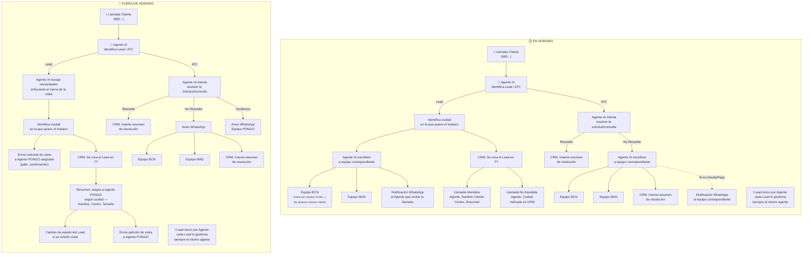

# Flujo de Llamadas — Agentes IA PONGO

---

### Notas
- **Lead único por agente**: todas las comunicaciones de un Lead siempre las gestiona el mismo agente asignado.
- Diagrama generado a partir de `Flujo_Agentes_IA_PONGO.xlsx`. Si el flujo cambia, edita el bloque `mermaid` de arriba y vuelve a subir el archivo — GitHub lo re-renderiza automáticamente.
