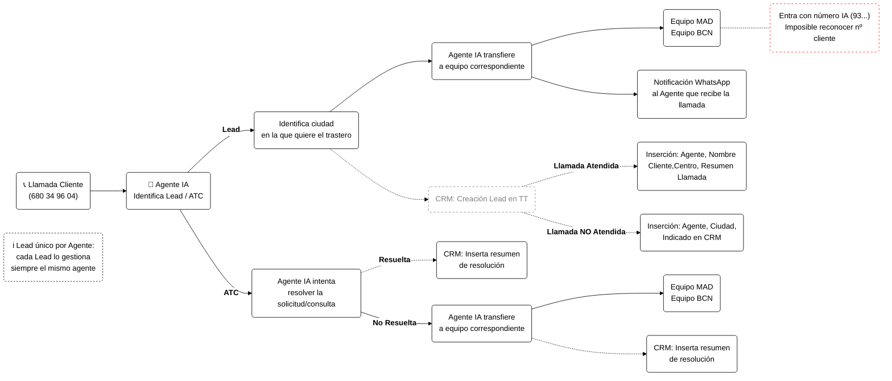

# Flujo de Llamadas — En Horario

---

### Notas
- **Lead único por agente**: todas las comunicaciones de un Lead siempre las gestiona el mismo agente asignado.
- Diagrama generado a partir de `Flujo_Agentes_IA_PONGO.xlsx`.
